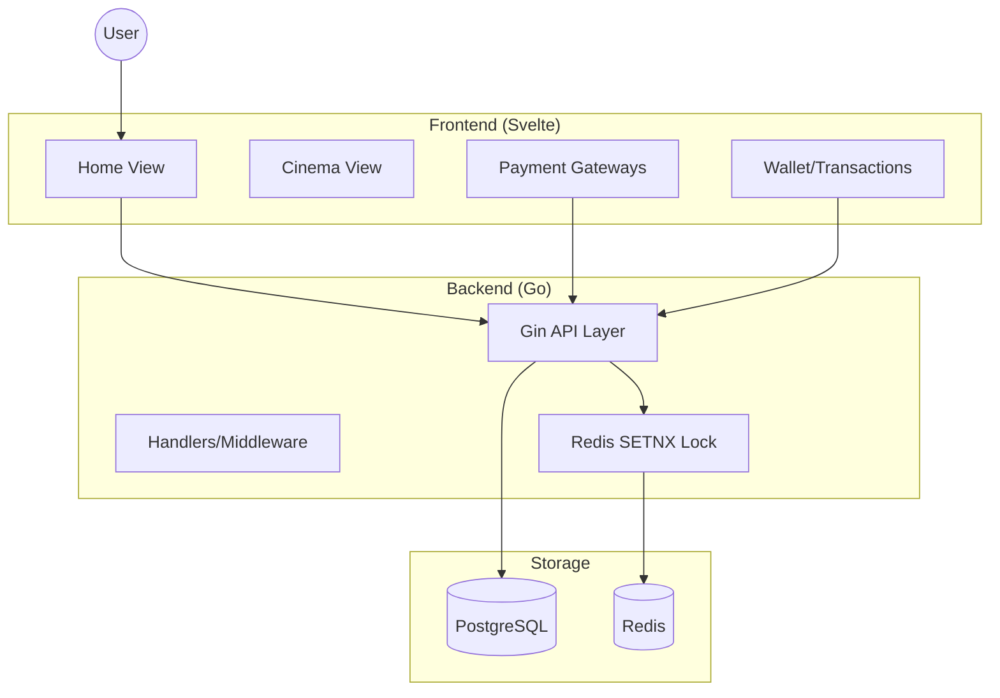

# BookMyShow MVP Clone (Go + Svelte)


A high-performance, robust movie booking application with integrated financial tools and multiplex chaining.


## 🚀 Key Features


### 🎬 Cinema & Booking
- **Multiplex Chains**: Support for PVR-INOX, Cinepolis, and Independent theatres.
- **Dual Flow**: Book by movie or explore specific theatres/chains.
- **Seat Locking**: Real-time Redis-based seat locking (5-minute TTL) to prevent double booking.
- **Smart Formats**: Dynamic filtering for IMAX, 4DX, and 2D based on theatre capabilities.

### Walkthrough:


### 💰 Financial Ecosystem (USP)
- **Unified Wallet**: Manage payments, investments, and refunds in one place.
- **BMSCash Refunds**: Automatic 70% refund to wallet for eligible cancellations (>2h before showtime).
- **Inflation Protection**: Invest ₹500+ to "freeze" ticket rates and unlock a permanent 20% discount.
- **Transaction Logs**: Full transparency for all payments, investments, and refunds.


### ⭐ Engagement
- **Star Ratings**: Rate your movie experience after booking.
- **Modern UI**: responsive Svelte frontend with Bootstrap aesthetics.

## 🛠️ Tech Stack
- **Backend**: Go (Gin, GORM, Redis-Go)
- **Database**: PostgreSQL (Persistence), Redis (Locking)
- **Frontend**: Svelte 5 + Bootstrap 5
- **Communication**: RESTful API / JSON

## 📊 Architecture Diagram



## ⚙️ Setup Instructions

1. **Prerequisites**: Go 1.25+, Docker, Node.js.
2. **Run Databases**:
   ```bash
   docker run --name bms-db -e POSTGRES_PASSWORD=password123 -p 5432:5432 -d postgres:alpine
   docker run --name bms-redis -p 6379:6379 -d redis:alpine
   ```
3. **Start Backend**:
   ```bash
   cd backend
   go run main.go
   ```
4. **Start Frontend**:
   ```bash
   cd frontend
   npm run dev
    ```
   
## 🐳 Docker Deployment

The entire stack can be launched with a single command:

```bash
docker compose up --build
```

- **Frontend**: http://localhost:5173
- **Backend**: http://localhost:8080
- **Postgres**: localhost:5432
- **Redis**: localhost:6379

## 🧪 CI/CD
Automated builds and tests are handled via **GitHub Actions** (`.github/workflows/ci.yml`), ensuring that every push to `main` is buildable and robust.

## A Note on the deployment:
If you're reading this after mid-Apr26, you'll likely hit an error with the URL as my GCP trial would expire by then.
